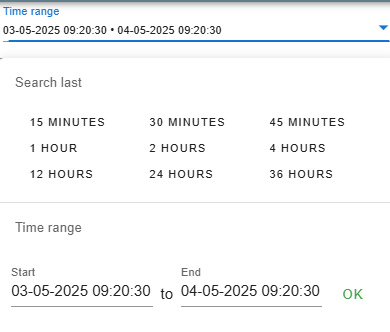

# ZaloScript

**Quality of Life improvements for the Zalos3 environment.**

### 📘 List

- [How To Install?](#how-to-install)
- [Article Search](#article-search)
- [Item Overview](#item-overview)
- [Quality Label Protocol](#quality-label-protocol)
- [Telegram Tracer](#telegram-tracer)
- [Workbench Selector](#workbench-selector)
- [Advize Auto Sort](#advize-auto-sort)
- [Shipping Notice Viewer Copy Table](#shipping-notice-viewer-copy-table)

## How To Install?
**1.Install the Tampermonkey extension**

If you don’t already have it, install Tampermonkey from your browser's extension store:

- [Chrome Web Store](https://chrome.google.com/webstore/detail/tampermonkey/dhdgffkkebhmkfjojejmpbldmpobfkfo)

**2.Enable Developer mode**

If you don't already have it turned on, turn on in the extensions setting in your browser.

- [Open Chrome Extensions](chrome://extensions/)

**3.Install the selected script**

  Just select which script you would like to add from the list below. 
  You will be re-directed to the Tampermonkey website that will show you a script preview. 
  Click <strong>Install</strong> to add it to your browser.

**4.Reload the Zalos website**

Once installed, simply reload or revisit the website for the designated addon to activate it.

**5.Enjoy!**

## Article Search
Provides the possibility to copy individual or multi EAN informations for the JIRA process.

- **[Install Article Search Script](https://github.com/MariuszKrupinski/ZaloScript/raw/refs/heads/main/Article-Search-script.user.js)**

## Item Overview
Provides additional options to copy selected columns of informations in the Location.

- **[Install Item Overview Script](https://github.com/MariuszKrupinski/ZaloScript/raw/refs/heads/main/Item-Overview-script.user.js)**

## Quality Label Protocol
Provides an extra option to show/hide elements in the table.

- **[Install Quality Label Protocol Script](https://github.com/MariuszKrupinski/ZaloScript/raw/refs/heads/main/Quality-Label-Protocol-script.user.js)**

## Telegram Tracer
Automates the 1st message log for selected time in a bulk action.

- **[Install Telegram Tracer Script](https://github.com/MariuszKrupinski/ZaloScript/raw/refs/heads/main/TelegramTracer-AutoExcec-script.user.js)**

 
  
  Images  

  

## Workbench Selector
Allows dynamic switching between different Zalos3 workbenches + modular configurations.

- **[Install Workbench Selector Script](https://github.com/MariuszKrupinski/ZaloScript/raw/refs/heads/main/Workbench-Selector-script.user.js)**

## Advize Auto Sort
Adding a Plane in top Right to automate sort to target with a Delay (adjustable) system

- **[Install Advize Auto Sort Script](https://github.com/MariuszKrupinski/ZaloScript/raw/refs/heads/main/Advize-Auto-Sort-script.user.js)**

## Shipping Notice Viewer Copy Table

- **[Install Shipping Notice Viewer Copy Table](https://github.com/MariuszKrupinski/ZaloScript/raw/refs/heads/main/SNV-script.user.js)**

// @updateURL    https://raw.githubusercontent.com/MariuszKrupinski/ZaloScript/main/
// @downloadURL  https://raw.githubusercontent.com/MariuszKrupinski/ZaloScript/main/
